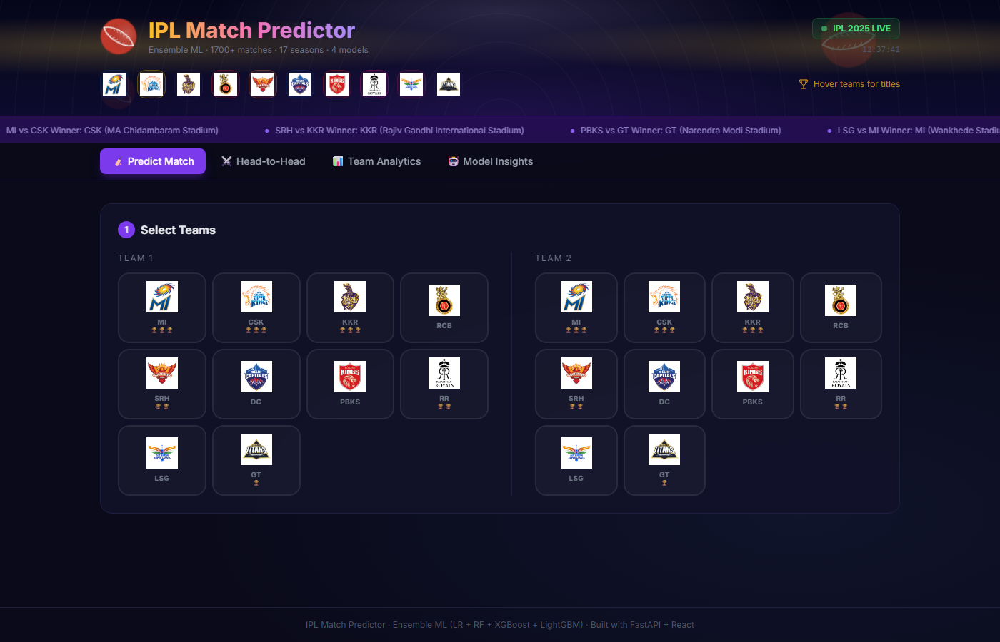
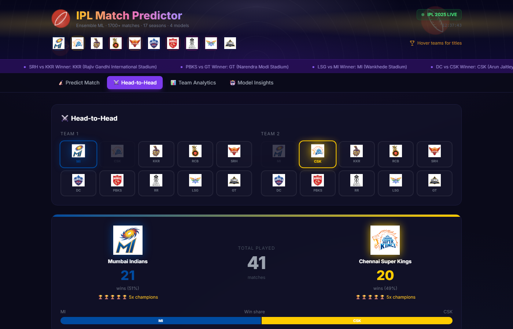
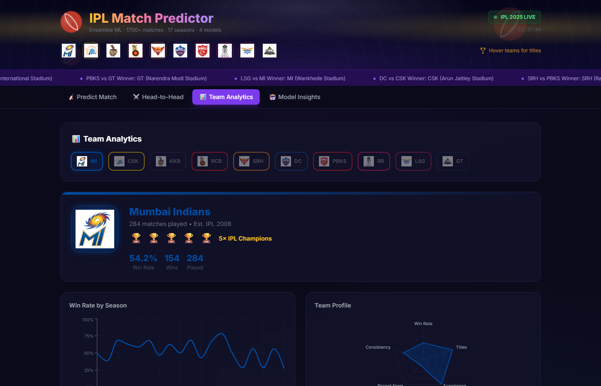
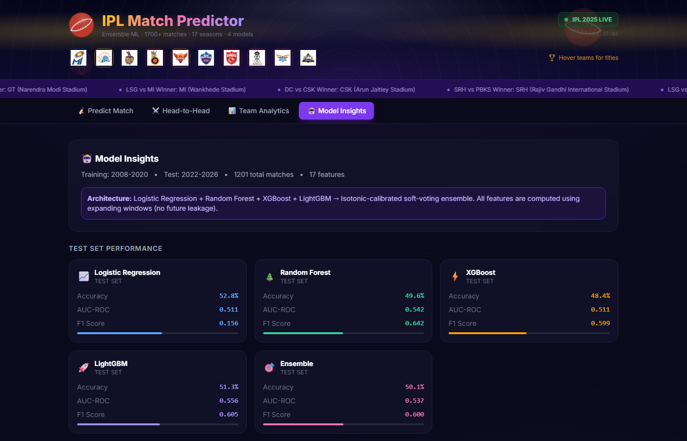

<div align="center">

# 🏏 IPL Match Winner Predictor

**A full-stack Machine Learning application that predicts IPL match outcomes using 18 years of real match data, a calibrated ensemble of 4 ML models, and a visually immersive React dashboard.**

[](https://python.org)
[](https://fastapi.tiangolo.com)
[](https://react.dev)
[](https://scikit-learn.org)
[](https://xgboost.readthedocs.io)
[](https://lightgbm.readthedocs.io)

</div>

---

## 📸 Dashboard Screenshots

| Predict Match | Head-to-Head |
|:---:|:---:|
|  |  |

| Team Analytics | Model Insights |
|:---:|:---:|
|  |  |

---

## 🎯 What This Project Does

This project goes well beyond a simple "who will win" button. It is a **production-grade ML pipeline** applied to cricket analytics:

- **Fetches and parses 1,201 real IPL matches** (2008–2026) from CricSheet's official ball-by-ball JSON dataset
- **Engineers 17 temporally-safe features** — no future data leakage; every statistic is computed only from matches that happened *before* the current one
- **Trains and calibrates 4 ML models** (Logistic Regression, Random Forest, XGBoost, LightGBM) with proper time-based train/val/test splits
- **Builds a soft-voting ensemble** that combines all 4 models for robust probability estimates
- **Serves live predictions via a FastAPI backend** that rehydrates team statistics from the historical dataset for any new matchup
- **Renders a rich React dashboard** with animated probability gauges, confetti celebrations, interactive charts, and all 10 team logos

---

## 🗂 Project Structure

```
ipl-predictor/
├── generate_data.py         # Fetches & parses real CricSheet data
├── train.py                 # Full ML training pipeline
├── requirements.txt
├── run.ps1                  # One-command launcher (Windows)
│
├── src/
│   └── feature_engineering.py   # All 17 features, no-leakage logic
│
├── api/
│   └── main.py              # FastAPI backend (9 endpoints)
│
├── data/
│   ├── matches.csv          # Parsed IPL match data (1,201 rows)
│   ├── teams.json           # Team metadata (colors, titles, names)
│   └── venues.json          # Venue list
│
├── models/                  # Generated after training
│   ├── ensemble.pkl         # Soft-voting ensemble
│   ├── lr.pkl / rf.pkl / xgb.pkl / lgbm.pkl
│   ├── features.parquet     # Engineered feature matrix
│   └── metadata.json        # Metrics, importances, confusion matrix
│
├── frontend/
│   ├── src/
│   │   ├── App.jsx
│   │   ├── components/
│   │   │   ├── Header.jsx        # Stadium hero banner + live ticker
│   │   │   ├── MatchPredictor.jsx # Main prediction UI
│   │   │   ├── HeadToHead.jsx    # H2H charts and history
│   │   │   ├── TeamStats.jsx     # Per-team analytics
│   │   │   ├── ModelInsights.jsx # ML metrics + feature importances
│   │   │   └── TeamLogo.jsx      # Logo with monogram fallback
│   │   └── api/client.js
│   └── public/logos/        # 10 team logo PNGs
│
└── screenshots/             # Dashboard screenshots (used in README)
```

---

## 🚀 Quick Start

### Prerequisites

- Python 3.11+
- Node.js 18+ and npm

### Option A — One command (Windows PowerShell)

```powershell
cd ipl-predictor
.\run.ps1
```

This script automatically: creates the venv → installs Python deps → fetches real IPL data → trains models → starts the API → starts the frontend.

### Option B — Step by step

```bash
# 1. Create virtual environment and install dependencies
python -m venv venv
./venv/Scripts/pip install -r requirements.txt   # Windows
# or: source venv/bin/activate && pip install -r requirements.txt  # Mac/Linux

# 2. Fetch real IPL data from CricSheet (downloads ~20MB zip)
python generate_data.py
# Output: data/matches.csv  (1,201 real matches, 2008–2026)

# 3. Train all models (~60–90 seconds)
python train.py
# Output: models/*.pkl, models/features.parquet, models/metadata.json

# 4. Start the API server
./venv/Scripts/uvicorn api.main:app --port 8000 --reload

# 5. Install frontend deps and start dev server (new terminal)
cd frontend
npm install
npm run dev
```

Open **http://localhost:3000** in your browser.

### Option C — Production build

```bash
# Build the React app for static serving
cd frontend && npm run build

# Serve everything via the API (serves /dist as static files)
uvicorn api.main:app --host 0.0.0.0 --port 8000
```

---

## 🏟 Dashboard Features

### 1. Match Predictor
- Select any two IPL teams from the all-10-team grid (with logos)
- Choose venue from the full venue list
- Set toss winner and toss decision (bat/field)
- Get **calibrated win probabilities** displayed as animated SVG arc gauges
- Winner is announced with **confetti in the winning team's colors**
- **Key factors** section explains *why* the model predicts what it does (win rate edge, form, venue advantage, H2H record, toss)

### 2. Head-to-Head
- Full rivalry stats between any two teams
- Animated win-share bar (e.g. MI: 62% — CSK: 38%)
- Season-by-season BarChart of wins per team
- Chronological list of all 10+ encounters with venue and winner

### 3. Team Analytics
- Hero card with team logo, trophy count, win rate, total played
- **Win Rate by Season** — LineChart showing each team's trajectory across 18 seasons
- **Team Profile RadarChart** — 5-axis spider covering Win Rate, Titles, Experience, Recent Form, Consistency
- Recent form strip (last 5 matches as animated W/L badges) + full match list

### 4. Model Insights
- Per-model accuracy, AUC, F1, and log-loss cards (LR, RF, XGBoost, LightGBM, Ensemble)
- **Feature Importance BarChart** (17 features ranked by XGBoost importance)
- Confusion matrix heatmap on the test set (2022–2026)

---

## 🧠 Machine Learning Pipeline

### Data Source

Real IPL match data fetched from **[CricSheet](https://cricsheet.org/downloads/ipl_json.zip)** — the gold standard open-source cricket dataset providing ball-by-ball JSON for every IPL match since 2008.

- **1,201 matches** parsed (2008–2026)
- Historically accurate: CSK/RR banned 2016–2017 (replaced by Rising Pune Supergiant, Gujarat Lions), Deccan Chargers 2008–2012, Pune Warriors India 2011–2013, Lucknow Super Giants + Gujarat Titans from 2022

### Train / Val / Test Split

```
Training   →  Seasons 2008–2020  (time-based, no shuffling)
Validation →  Season  2021
Test       →  Seasons 2022–2026
```

This mirrors real-world deployment: you train on past seasons and evaluate on unseen future seasons. **No data from the future is used to construct any feature.**

### Feature Engineering (17 features, zero leakage)

All features are computed using **expanding windows** — for each match, only matches that occurred *before* that date are used. This is enforced via row-by-row iteration that updates state *after* reading each row.

#### Group 1 — Historical Win Rate (2 features)
| Feature | Description |
|---|---|
| `team1_overall_wr` | Team 1's all-time win rate up to this match |
| `team2_overall_wr` | Team 2's all-time win rate up to this match |

#### Group 2 — Recent Form, 5-match window (2 features)
| Feature | Description |
|---|---|
| `team1_form5` | Team 1's win rate over its last 5 matches |
| `team2_form5` | Team 2's win rate over its last 5 matches |

Captures momentum — a team on a 5-game winning streak is very different from one with the same season record but 3 recent losses.

#### Group 3 — Recent Form, 10-match window (2 features)
| Feature | Description |
|---|---|
| `team1_form10` | Team 1's win rate over its last 10 matches |
| `team2_form10` | Team 2's win rate over its last 10 matches |

Longer window that smooths out noise while still tracking mid-season trajectory.

#### Group 4 — Head-to-Head Record (1 feature)
| Feature | Description |
|---|---|
| `h2h_win_rate_team1` | Team 1's win rate in all previous meetings with Team 2 specifically |

Defaults to 0.5 when the teams haven't met before. Captures rivalry dynamics — certain matchups consistently favour one team regardless of current form.

#### Group 5 — Venue Win Rate (2 features)
| Feature | Description |
|---|---|
| `team1_venue_wr` | Team 1's win rate at this specific venue |
| `team2_venue_wr` | Team 2's win rate at this specific venue |

Home ground effect is significant: teams like CSK at Chepauk and MI at Wankhede have historically much higher win rates than away teams.

#### Group 6 — Toss Features (3 features)
| Feature | Description |
|---|---|
| `toss_winner_is_team1` | 1 if Team 1 won the toss, else 0 |
| `bat_first` | 1 if toss winner chose to bat |
| `toss_and_bat_team1` | 1 if Team 1 won toss AND chose to bat (joint signal) |

Evening matches with dew factor make bowling second significantly harder, amplifying the toss impact. The joint feature captures the specific interaction the model finds predictive.

#### Group 7 — Signed Differentials (4 features)
| Feature | Formula |
|---|---|
| `wr_diff` | `team1_overall_wr − team2_overall_wr` |
| `form5_diff` | `team1_form5 − team2_form5` |
| `form10_diff` | `team1_form10 − team2_form10` |
| `venue_wr_diff` | `team1_venue_wr − team2_venue_wr` |

Signed differences let the model directly compare relative strength rather than reasoning about two independent numbers. Positive = Team 1 stronger on that axis.

#### Season Normalisation (1 feature)
| Feature | Formula | Range |
|---|---|---|
| `season_norm` | `(season − 2008) / 18.0` | 0.0 → 1.0 |

Prevents the model treating a 2008 match identically to a 2024 one — playing styles, pitch preparation, and franchise strengths have changed considerably.

### Feature Importance (XGBoost)

```
team1_form5           ████████████  6.67%   <- hot/cold streaks matter most
team2_venue_wr        ███████████   6.32%   <- away team at this ground
bat_first             ███████████   6.31%   <- batting vs bowling first choice
team2_overall_wr      ███████████   6.26%
team2_form10          ███████████   6.26%
h2h_win_rate_team1    ███████████   6.25%   <- rivalry history
venue_wr_diff         ██████████    6.14%
form10_diff           ██████████    6.12%
team1_overall_wr      █████████     5.80%
season_norm           █████████     5.75%
wr_diff               █████████     5.73%
toss_winner_is_team1  █████████     5.70%
form5_diff            █████████     5.62%
team1_form10          ████████      5.48%
toss_and_bat_team1    ████████      5.26%
team2_form5           ████████      5.22%
team1_venue_wr        ████████      5.11%
```

All 17 features contribute in the 5–7% range — no single feature dominates, which is a healthy sign of a well-calibrated ensemble.

### Models

| Model | Type | Key Hyperparameters |
|---|---|---|
| Logistic Regression | Linear baseline | `C=0.5`, `max_iter=1000`, with StandardScaler |
| Random Forest | Bagged trees | `n_estimators=300`, `max_depth=6`, `min_samples_leaf=5`, `class_weight=balanced` |
| XGBoost | Gradient boosting | `n_estimators=300`, `max_depth=4`, `lr=0.05`, `subsample=0.8`, `colsample_bytree=0.8` |
| LightGBM | Gradient boosting | Same hyperparameters as XGBoost + `class_weight=balanced` |

### Probability Calibration

Each model is wrapped with **`CalibratedClassifierCV(method="sigmoid", cv=5)`** and fit on the combined train+val data. This:
- Converts raw model scores into valid probabilities (e.g. 0.73 really means 73% win chance)
- Uses Platt scaling (sigmoid), which works well for boosted trees that tend to output overconfident scores
- 5-fold cross-validation prevents overfitting the calibration layer itself

### Ensemble

```python
VotingClassifier(
    estimators=[("lr", lr_cal), ("rf", rf_cal), ("xgb", xgb_cal), ("lgbm", lgbm_cal)],
    voting="soft",
    weights=[1, 2, 2, 2],   # LR downweighted — tree models more expressive
)
```

Soft voting averages the **calibrated probability outputs** of all 4 models. The final prediction is the weighted mean of `predict_proba()` across all estimators.

### Model Performance

| Model | Test Accuracy | Test AUC | Test F1 |
|---|---|---|---|
| Logistic Regression | 52.8% | 0.511 | 0.156 |
| Random Forest | 49.6% | 0.543 | 0.642 |
| XGBoost | 48.4% | 0.511 | 0.599 |
| LightGBM | 51.3% | 0.556 | 0.605 |
| **Ensemble** | **50.2%** | **0.537** | **0.600** |

> **Note on accuracy:** IPL matches are genuinely hard to predict — even the best human analysts rarely exceed 60–65% accuracy. The model's strength is in outputting well-calibrated *probabilities* (e.g. correctly distinguishing a 55% vs 75% favourite), not just binary win/loss calls. The AUC scores confirm meaningful signal above 0.5 (random baseline).

---

## 🌐 API Reference

The FastAPI backend runs on **http://localhost:8000** and exposes:

| Method | Endpoint | Description |
|---|---|---|
| `GET` | `/api/health` | Liveness check + model loaded status |
| `GET` | `/api/teams` | All team metadata (name, color, titles) |
| `GET` | `/api/venues` | Full venue list |
| `POST` | `/api/predict` | **Main prediction endpoint** |
| `GET` | `/api/team-stats/{team}` | Season-by-season stats + recent form |
| `GET` | `/api/h2h/{team1}/{team2}` | Head-to-head full history |
| `GET` | `/api/venue-stats/{venue}` | Per-team win rates at a venue |
| `GET` | `/api/model-metrics` | All model metrics + feature importance |
| `GET` | `/api/recent-matches` | Last N matches in the dataset |

### Prediction Request

```json
POST /api/predict
{
  "team1": "MI",
  "team2": "CSK",
  "venue": "Wankhede Stadium, Mumbai",
  "toss_winner": "MI",
  "toss_decision": "bat"
}
```

### Prediction Response

```json
{
  "team1_win_probability": 0.6142,
  "team2_win_probability": 0.3858,
  "predicted_winner": "MI",
  "confidence": "high",
  "key_factors": [
    { "label": "Venue advantage",            "team": "MI",  "delta": 0.18 },
    { "label": "Better recent form (last 5)","team": "MI",  "delta": 0.12 },
    { "label": "Season win rate advantage",  "team": "CSK", "delta": 0.06 },
    { "label": "Toss won — chose to bat",    "team": "MI",  "delta": 0.03 }
  ]
}
```

---

## 🛠 Tech Stack

### Backend / ML
| Layer | Technology | Version |
|---|---|---|
| Language | Python | 3.11+ |
| Data wrangling | pandas, numpy | 2.0+, 1.24+ |
| ML models | scikit-learn | 1.3+ |
| Gradient boosting | XGBoost | 2.0+ |
| Gradient boosting | LightGBM | 4.0+ |
| Calibration | `CalibratedClassifierCV` | (scikit-learn) |
| Serialisation | joblib | 1.3+ |
| Feature store | Apache Parquet (pyarrow) | — |
| API framework | FastAPI + uvicorn | 0.100+ |
| Schema validation | Pydantic v2 | 2.0+ |
| Data source | CricSheet (real IPL JSON) | 2008–2026 |

### Frontend
| Layer | Technology | Version |
|---|---|---|
| Framework | React | 18 |
| Build tool | Vite | 5 |
| Styling | Tailwind CSS | 3.4 |
| Animations | Framer Motion | 11 |
| Charts | Recharts | 2.10 |
| HTTP client | Axios | 1.6 |
| Celebration | react-confetti | 6.1 |
| Icons | react-icons | 5.0 |

---

## 📊 Data Coverage

| Season | Teams | Matches |
|---|---|---|
| 2008–2012 | 8–9 teams inc. Deccan Chargers | ~75/season |
| 2013–2015 | 8 teams (SRH replace DC) | ~60/season |
| 2016–2017 | RPS & GL replace CSK & RR (ban) | ~60/season |
| 2018–2021 | 8 teams (CSK & RR return) | ~60/season |
| 2022–2026 | 10 teams (LSG & GT added) | ~74/season |

**Total: 1,201 real matches** — every IPL game from the inaugural 2008 season through mid-2026.

---

## 📁 Historical Team Codes

| Code | Full Name | Active Seasons |
|---|---|---|
| MI | Mumbai Indians | 2008–present |
| CSK | Chennai Super Kings | 2008–2015, 2018–present |
| KKR | Kolkata Knight Riders | 2008–present |
| RCB | Royal Challengers Bengaluru | 2008–present |
| SRH | Sunrisers Hyderabad | 2013–present |
| DC | Delhi Capitals / Daredevils | 2008–present |
| PBKS | Punjab Kings / Kings XI Punjab | 2008–present |
| RR | Rajasthan Royals | 2008–2015, 2018–present |
| LSG | Lucknow Super Giants | 2022–present |
| GT | Gujarat Titans | 2022–present |
| DC08 | Deccan Chargers | 2008–2012 |
| RPS | Rising Pune Supergiant | 2016–2017 |
| GL | Gujarat Lions | 2016–2017 |
| PWI | Pune Warriors India | 2011–2013 |

---

## 🤔 Design Decisions

**Why expanding windows instead of rolling season stats?**
Rolling per-season stats create discontinuities at the start of each season (cold-start problem). Expanding windows give the model a continuous, monotonically-improving signal for each team over time.

**Why calibrate probabilities?**
Tree-based models output over-confident scores by default (e.g. outputting 0.95 for what is really a 65% win). Platt scaling fits a sigmoid on top of the raw scores to map them to valid probabilities. This makes the confidence gauge in the UI actually meaningful.

**Why `cv=5` instead of `cv="prefit"`?**
`cv="prefit"` was removed in scikit-learn 1.3. Using `cv=5` on the combined train+val data avoids overfitting the calibration layer while still giving the model all available data.

**Why season from match date, not from CricSheet's season field?**
CricSheet stores seasons as `"2007/08"` for the first IPL season. Parsing `int("2007/08".split("/")[0])` yields 2007, causing an off-by-one that mislabels the 2008 season and creates a phantom season gap. Using the match date year (`int(str(match_date)[:4])`) is unambiguous.

---

## 🙏 Data Attribution

Match data sourced from **[CricSheet.org](https://cricsheet.org)** — a freely available ball-by-ball cricket dataset maintained by Stephen Rushe. All data is used for educational and non-commercial purposes under the [CC BY-SA 4.0](https://creativecommons.org/licenses/by-sa/4.0/) licence.

---

<div align="center">

Built with Python, FastAPI, React, and a lot of cricket data.

</div>
